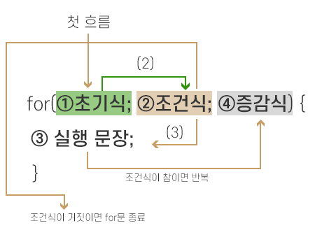

# 제어문

### 블록문

블록문은 0개 이상의 문을 중괄호( {} )로 묶은 것으로, 코드 블록 또는 블록이라고 불리운다.

알아둘 것은, 블록문은 언제나 문의 종료를 의미하는 자체 종결성을 가지므로 세미콜론을 붙이지 않는다.

```javascript
var x = 1;

if (x < 10) {
    x += 1;
}

---

function sum(a, b) {
    return a + b;
}
```

### 조건문

* **if...else 문**

```javascript
if (조건식) {
  // 조건식이 참이면 이 코드 블록이 실행된다.
} else {
  // 조건식이 거짓이면 이 코드 블록이 실행된다.
}

// 추가 조건이 생길경우
if (조건식1) {
  // 조건식1이 참이면 이 코드 블록이 실행된다.
} else if (조건식2) {
  // 조건식2가 참이면 이 코드 블록이 실행된다.
} else {
  // 조건식1과 2가 모두 거짓이면 이 코드 블록이 실행된다.
}
```

> 만약 코드 블록 내의 문이 하나뿐이라면 중괄호를 생략할 수 있다. if (조건식) break;

* **if...else 문을 삼항 조건 연산자로 바꿔 쓰기**

```javascript
// if...else 문
var x = 2;
var result;

if (x % 2) {
  result = "홀수";
} else {
  result = "짝수";
}

console.log(result); // '짝수' 0은 false로 취급된다.

// 삼항 조건 연산자로 변환
var x = 2;

var result = x % 2 ? "홀수" : "짝수";
console.log(result); // '짝수' 이유는 위와 같다

// 만약 경우의 수가 세 가지 (양수, 음수, 영)
var num = 2;

var kind = num ? (num > 0 ? "양수" : "음수") : "영";
console.log(kind); // '양수'
```

if 문의 조건식은 **불리언 값으로 평가되어야하며** 불리언이 아닌 값으로 평가되면 자바스크립트 엔진에 의해 암묵적으로 불리언 값으로 강제 변환되어 실행할 코드 블록을 결정한다.

***

* **switch 문**

논리적 참, 거짓보다는 다양한 상황에 따라 실행될 코드 블록을 결정할 때 사용된다.

```javascript
// default 문은 선택사항이다.
switch (표현식) {
    case 표현식1:
        스위치 문의 표현식과 표현식1이 일치하면 실행될 문;
        break;
    case 표현식2:
        스위치 문의 표현식과 표현식2가 일치하면 실행될 문;
        break;
    default:
        스위치 문의 표현식과 일치하는 case가 없을 때 실행될 문;
}
```

* **switch 문 - 폴스루**

```javascript
var name = "kim";
var firstName;

switch (name) {
  case 1:
    firstName = "kim";
  case 2:
    firstName = "lee";
  case 3:
    firstName = "kang";
  default:
    firstName = "Invalid name";
}

console.log(firstName); // Invalid name

/*
'kim'이 출력되지 않는 이 현상은 switch 문을 탈출하지 않고 끝날 때까지 모든 case와 default 문을 실행한 폴스루 현상이다.

이는 case 문에 해당하는 문의 마지막에 break 문을 사용하지 않았기 때문이다.
*/

// 올바른 switch 사용법
var name = "kim";
var firstName;

switch (name) {
  case 1:
    firstName = "kim";
    break;
  case 2:
    firstName = "lee";
    break;
  case 3:
    firstName = "kang";
    break;
  default:
    firstName = "Invalid name";
  // default 문에는 break를 생략하는 것이 일반적이다. (어짜피 마지막에 실행되고 곧바로 빠져나가므로)
}

console.log(firstName); // 'kim'
```

if...else 문으로 해결할 수 있다면 if...else 문을 사용하는 편이 좋고 조건이 너무 많고 가독성이 좋지 않다면 switch 문을 사용하는 게 좋다. (알잘딱깔센 해라\~)

### 반복문

* **for 문**

조건식이 거짓으로 평가될 때까지 코드 블록을 반복 실행한다.

```javascript
for (변수 선언문; 조건식; 증감식) {
    조건식이 참인 경우 반복 실행될 문;
}

for (var i = 0; i <2; i++;) {
    console.log(i); // 0 1
}

// 선언문, 조건식, 증감식은 옵션이므로 반드시 사용할 필요 x 다만 아무것도 선언하지 않으면 무한루프
for (,,) { ... } // 무한루프
```

for 문의 실행 순서

> 사진 출처
>
> https://velog.io/@1\_doyeon/JavaScript-for%EB%AC%B8-%EC%82%AC%EC%9A%A9%EB%B2%95



1. 변수 선언문이 실행된다
2. 변수 선언문의 실행이 종료되면 조건식이 실행된다.
3. 증감식으로 가기 전 코드 블록으로 실행 흐름이 옮겨가고, 조건식 평과 결과를 실행한다.
4. 코드 블록의 실행이 종료되면 증감식이 실행된다.
5. 조건식의 평과 결과가 false가 되면 for문의 실행이 종료된다.

***

> for 문은 반복 횟수가 명확할 때 while 문은 반복 횟수가 불명확할 때

* **while 문**

조건식의 평과 결과가 참이면 코드 블록을 반복 실행한다.

```javascript
var count = 0;

while (count < 3) {
  console.log(count); // 0 1 2
  count += 1;
}

// 무한루프
while (true) { ... }
```

* **무한루프 탈출하기**

```javascript
var count = 0;

while (true) {
  console.log(count);
  count += 1;
  if (count === 3) break;
}
```

***

* **do...while 문**

**코드 블록을 먼저 실행**하고 조건식을 평가한다.

```javascript
var count = 0;

do {
  console.log(count); // 0 1 2
  count += 1;
} while (count < 3);
```

***

* **break 문**

레이블 문, 반복문, switch 문의 코드 블록을 탈출한다. 이 외에 사용하게 되면 SystaxError가 발생한다.

```javascript
if (true) {
    break; // Uncaught SyntaxError: Illegal break statement
}
```

레이블 문은 식별자가 붙은 문을 말한다.

```javascript
// foo라는 식별자
foo: {
  console.log(1);
  break foo; // foo 레이블 문을 탈출한다.
}

// 참고로 switch 문의 case, default 문도 레이블 문이다.
```

* **중첩 for문 탈출하기**

```javascript
// loop1 라는 식별자 (레이블)
loop1: for (var i = 0; i < 3; i++) {
  for (var j = 0; j < 3; j++) {
    // 내부 for문에서 break를 사용하면 외부 for문으로 진입하므로
    // break 에 레이블 문을 사용한다.
    if (i + j === 3) break loop1;
  }
}
```

참고로 레이블 문은 프로그램의 흐름이 복잡해져서 가독성이 나빠지고 오류를 발생시킬 가능성이 높으므로 **권장하지 않는다.**

***

* **continue 문**

코드 블록 실행을 **현 시점에서 중단하고 반복문의 증감식으로 실행 흐름을 이동**시킨다.

```javascript
let text = "";

for (let i = 0; i < 10; i++) {
  if (i === 3) {
    continue;
  }
  text = text + i;
}

console.log(text); // 012456789
```
